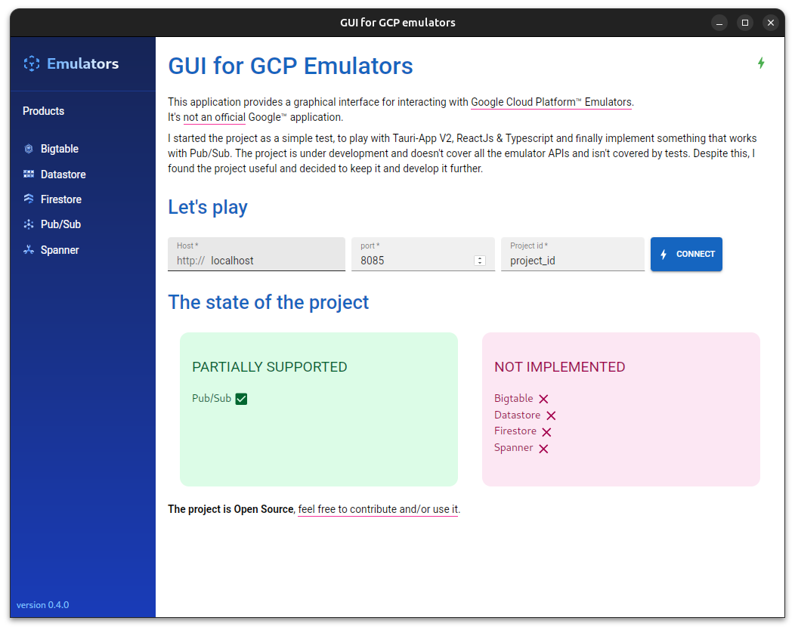
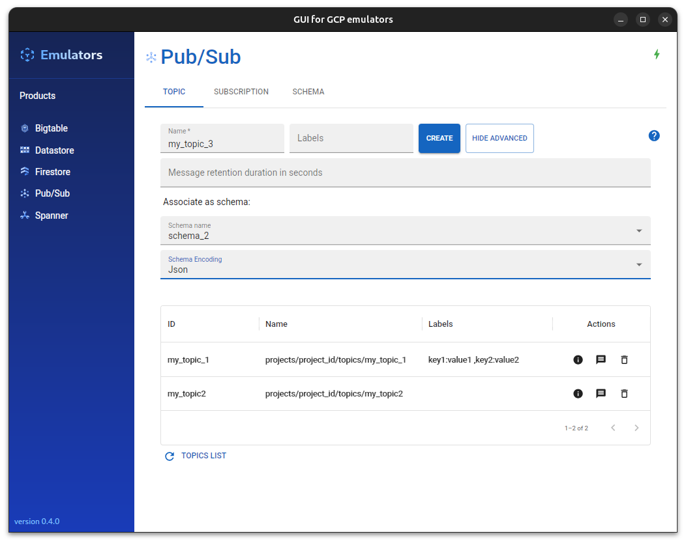
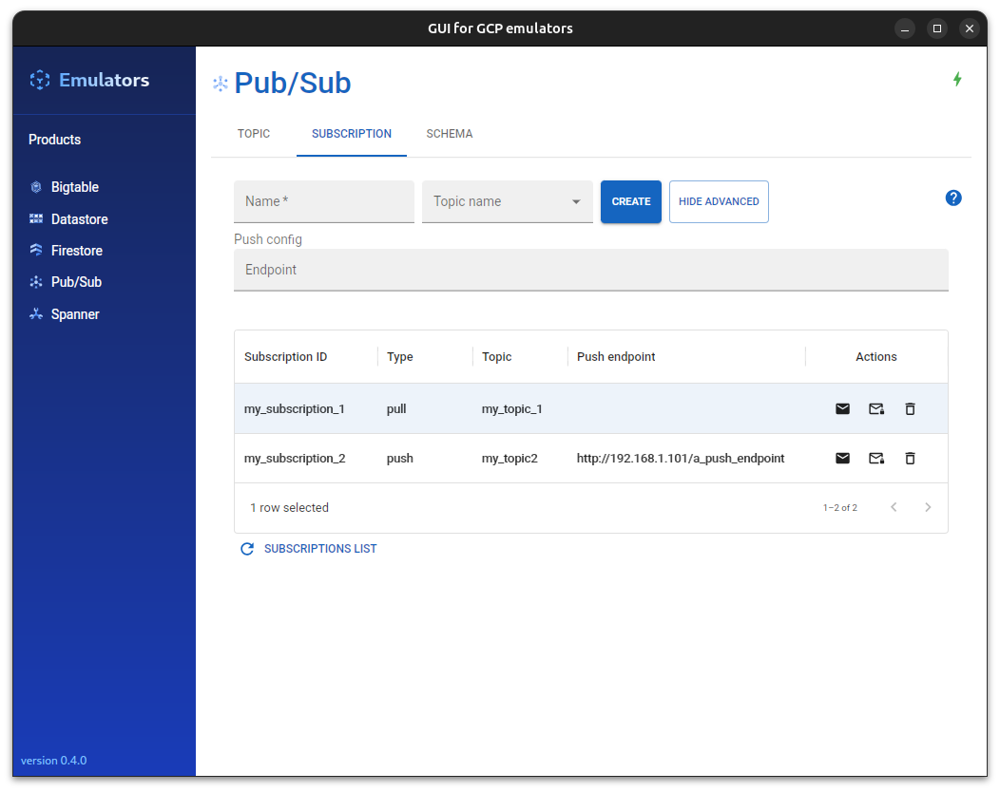
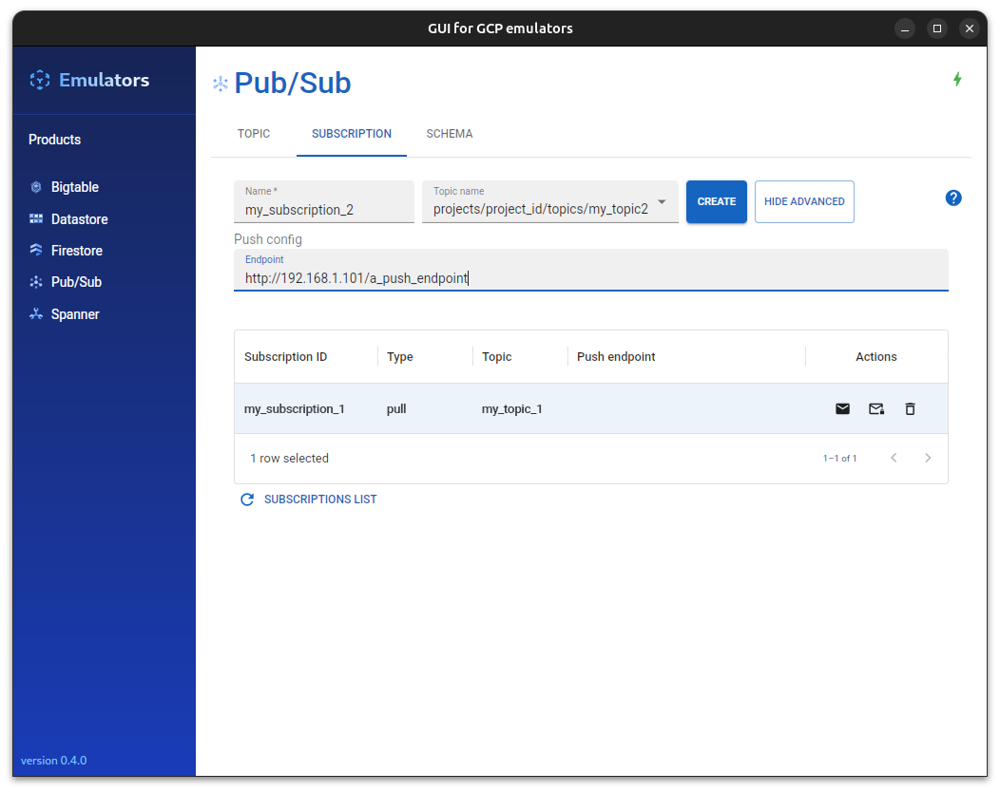
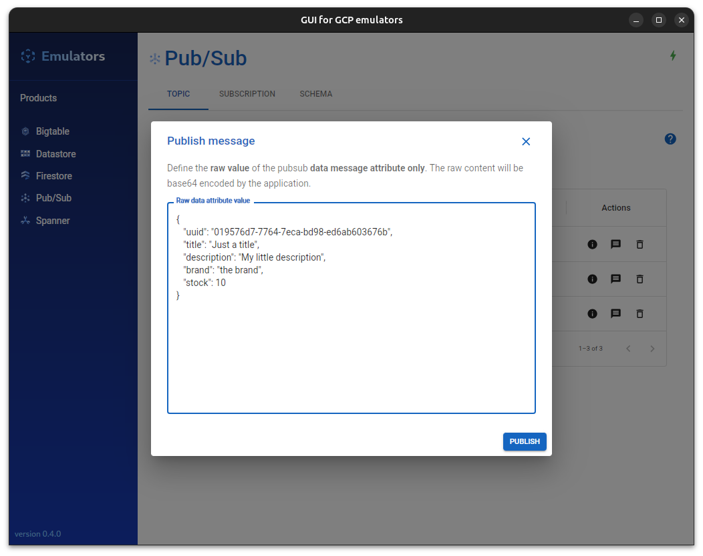
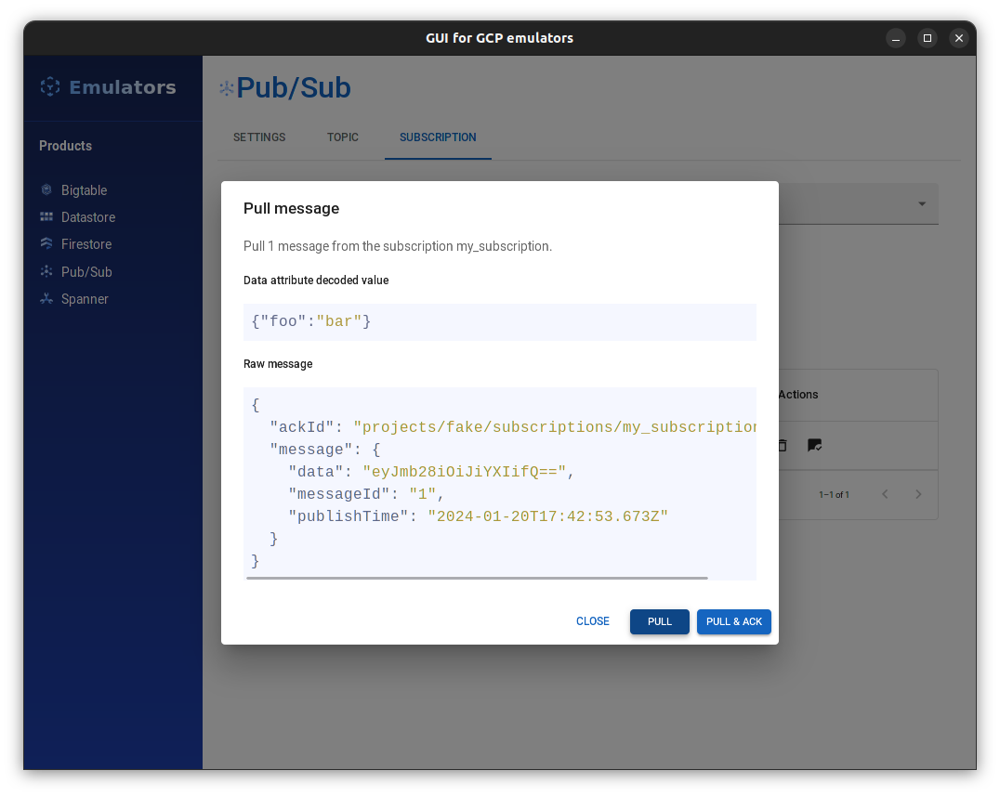
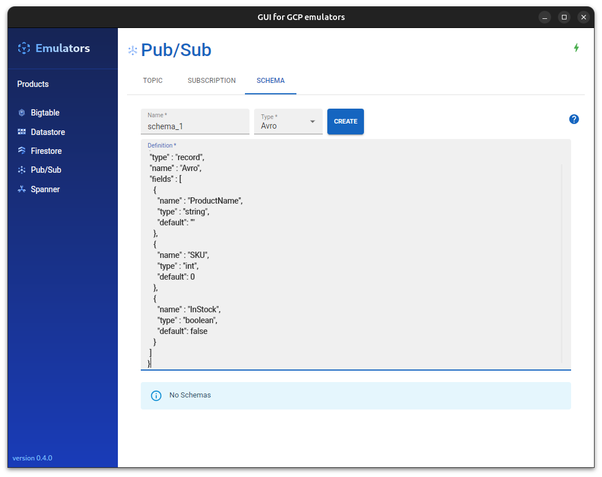
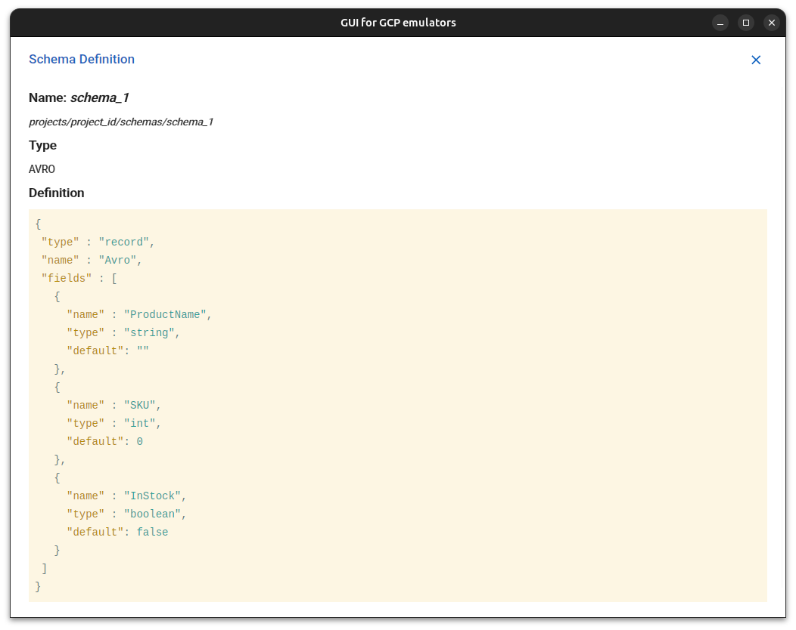

# GUI for Google Cloud Plateform Emulators

## Description

This application provides a basic UI for interacting with [Google Cloud Platform™ Emulators](https://cloud.google.com/sdk/gcloud/reference/beta/emulators).

This application is **not an official** Google application.

The application is under development and doesn't cover all emulator product APIs. I started this project to test Tauri App V2, then thought it would be intersting to provide something more functional.

As **Open source project**, feel free to participate, contribute, fork, etc. :

[https://github.com/FabienD/gui-for-gcp-emulator](https://github.com/FabienD/gui-for-gcp-emulator)

## Features

- PubSub emulator support :

  - Pubsub Topic management (Create, View, Delete, List).
  - Pubsub Subscription management (Create, Delete, List).
  - Publish messages in a Topic.
  - Pull messages & see details from a Subscription
  - Pubsub Schema management (Create, View, Delete, List).










## Next steps

- [x] Ehance UI and support for PubSub emulator.
- [x] Cover existing main features by end-to-end tests (run with [Playwright](https://playwright.dev/)).
- [ ] Provide application updater.

- [ ] Create Proxy Subscription to real GCP PubSub.
- [ ] Create BigQuery Subscription to Open Source BigQuery Emulator.

- [ ] Add UI and support for Firestore emulator.
- [ ] Add UI and support for Datastore emulator.
- [ ] Add UI and support for Bigtable emulator.
- [ ] Add UI and support for Spanner emulator.

## Build / Run the application

[Prerequisites, depends on the OS](https://v2.tauri.app/fr/start/prerequisites/)

### Run in dev mode

```shell
npm install
npm run tauri dev
```

### Build

```shell
npm run tauri build
```

### Launch tests

```shell
npm run test:e2e
# Use Playwright UI
npm run test:e2e:ui
```

## Technologies used

- [Tauri App V2](https://v2.tauri.app/)
- [Rust](https://www.rust-lang.org/)
- [React](https://react.dev/)
- [TypeScript](https://www.typescriptlang.org/)
- [Material UI](https://material-ui.com/)
- [Tailwind CSS](https://tailwindcss.com/)


## License

This project is under [GNU license](LICENSE)

### Tier assets license

"Animal Hive" icon created by "Diemen Design" is under MIT license, downloaded from [SVG Repo](https://www.svgrepo.com)