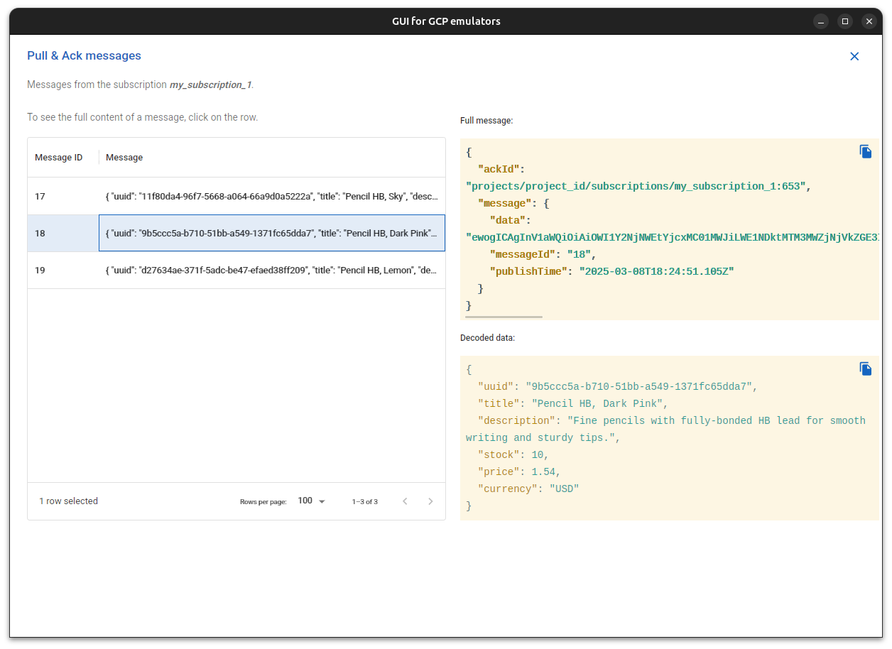

# GUI for Google Cloud Plateform Emulators

## Description

This application provides a basic UI for interacting [Google Cloud Platform™ Emulators](https://cloud.google.com/sdk/gcloud/reference/beta/emulators).

This application is **not an official** Google application.

The application is under heavy development and doesn't cover all emulator product APIs. I started this project to test Tauri App, then thought  it would be intersting to provide something more functional. As an exploration project, I didn't cover features by tests.

As **Open source project**, feel free to participate, contribute, fork, etc. :

[https://github.com/FabienD/gui-for-gcp-emulator](https://github.com/FabienD/gui-for-gcp-emulator)

## Features

- PubSub emulator support :

    - Create / Delete Pubsub topic
    - Publish a message in a topic
    - Create / Delete a topic Subscription (Pull & Push)
    - Pull a message from a Subscription

## Next steps

- Ehance UI and support for PubSub emulator.

- Add UI and support for Firestore emulator.
- Add UI and support  for Datastore emulator.
- Add UI and support  for Bigtable emulator.
- Add UI and support  for Spanner emulator.

## Build / Run the application

[Prerequisites, depends on the OS](https://tauri.app/fr/v1/guides/getting-started/prerequisites)

### Run in dev mode 

    npm run tauri dev

### Build

    npm run tauri build

## Technologies used

- [Tauri App](https://tauri.app/)
- [Rust](https://www.rust-lang.org/)
- [React](https://react.dev/)
- [TypeScript](https://www.typescriptlang.org/)
- [Material UI](https://material-ui.com/)
- [Tailwind CSS](https://tailwindcss.com/)
