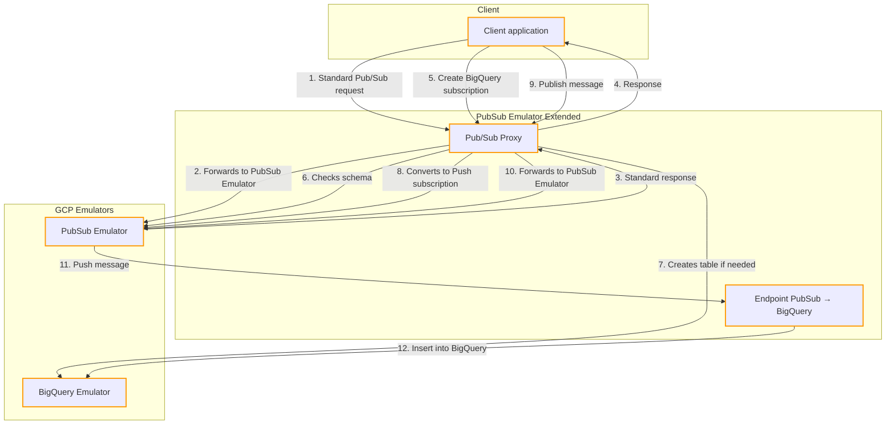

# PubSub Emulator Extended

This application extends the features of the Google Cloud Pub/Sub emulator by adding two main components:

## 1. Pub/Sub Proxy

This proxy intercepts communications with the Pub/Sub emulator and:

- **Fills a major gap** in the standard emulator: handling BigQuery subscriptions
- **Automates the process** when creating a BigQuery subscription:
  - Detects if the Pub/Sub topic has a schema or if the table exists in the (unofficial) BigQuery emulator.
    - If the topic has a schema and the table does not exist,
      - Automatically creates a corresponding BigQuery table with the appropriate structure.
  - Converts the subscription to Push mode towards the dedicated endpoint
- **Full transparency** for all other Pub/Sub requests, ensuring compatibility

## 2. Pub/Sub to BigQuery Endpoint

This component:

- Provides a **dedicated HTTP endpoint** for BigQuery subscriptions converted to push mode.
- **Processes and inserts** messages into BigQuery via the BigQuery API.

## How it works

